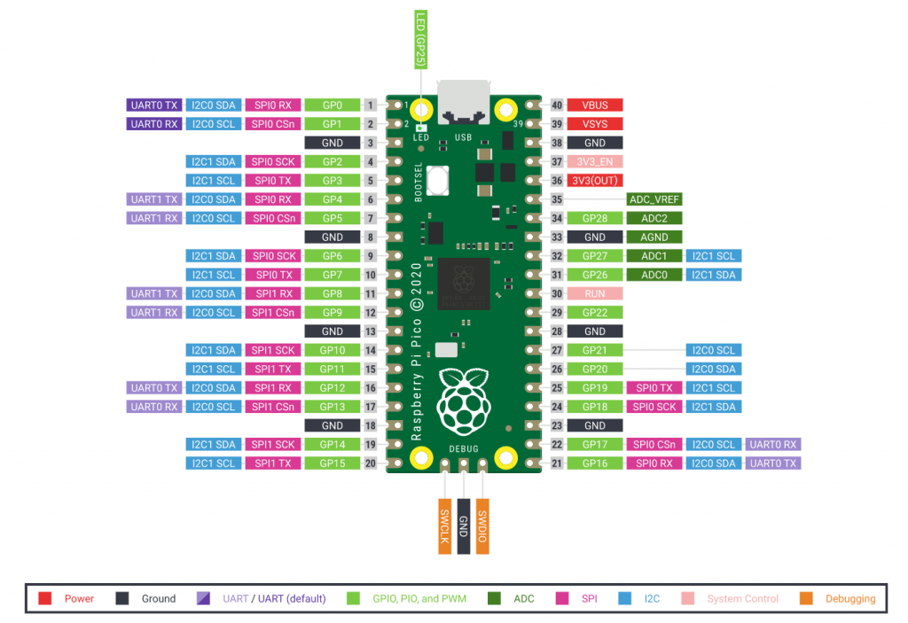

# Raspberri Pi Pico

## Sommaire

- Moteurs bipolaires : Un code pour gérer les moteurs bipolaires sous Pico

Les raspberry Pi Pico sont des microcontrôleurs développés par Raspberry Pi

## Brochage

